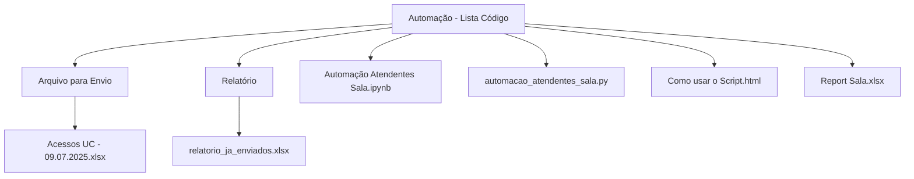

# Diagrama Estrutural do Projeto Automação Atendentes Sala

## Organização das Pastas e Arquivos

```mermaid
graph TD
    A[Automação - Lista Código] --> B[Arquivo para Envio]
    A --> C[Relatório]
    A --> D[Automação Atendentes Sala.ipynb]
    A --> E[automacao_atendentes_sala.py]
    A --> F[Como usar o Script.html]
    A --> G[Report Sala.xlsx]

    B --> H["Acessos UC - 09.07.2025.xlsx"]
    C --> I["relatorio_ja_enviados.xlsx"]
```

Use este diagrama para ilustrar a estrutura do projeto no trabalho.